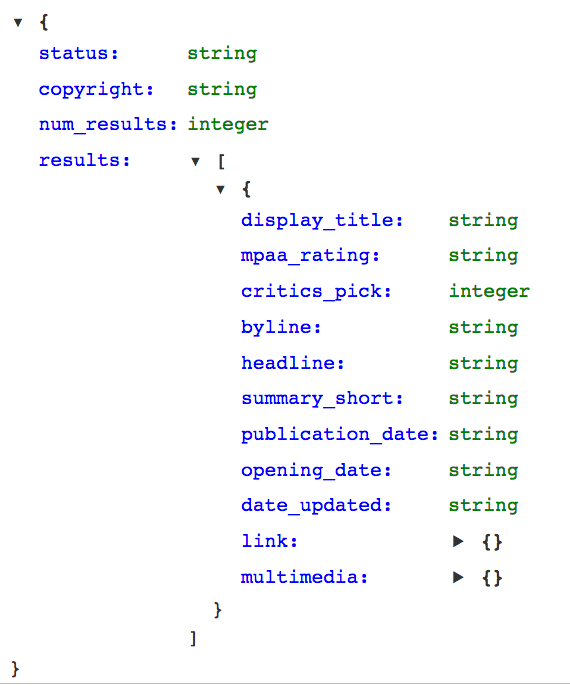
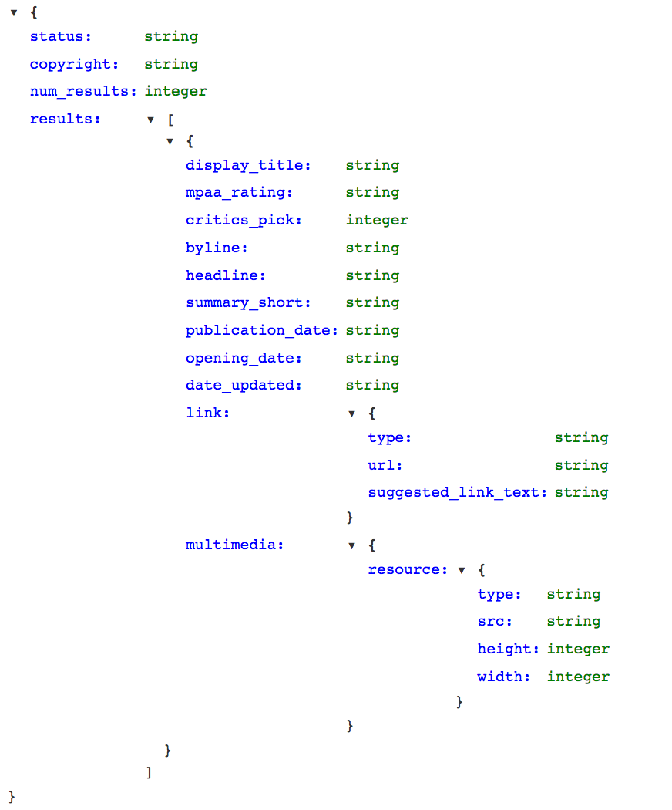

# Working with Known JSON Schemas - Lab

## Introduction
In this lab, you'll practice working with JSON files whose schema you know beforehand.

## Objectives

You will be able to:

* Use the `json` module to load and parse JSON documents
* Extract data using predefined JSON schemas
* Convert JSON to a pandas dataframe

## Reading a JSON Schema

Here's the JSON schema provided for a section of the NY Times API:


or a fully expanded view:



You can more about the documentation [here](https://developer.nytimes.com/docs/movie-reviews-api/1/routes/reviews/%7Btype%7D.json/get).

Note that **this is a different schema than the schema used in the previous lesson**, although both come from the New York Times.

## Loading the JSON Data

Open the JSON file located at `ny_times_movies.json`, and use the `json` module to load the data into a variable called `data`.


```python
# Your code here
```

Run the code below to investigate its contents:


```python
# Run this cell without changes
print("`data` has type", type(data))
print("The keys are", list(data.keys()))
```

## Loading Results

Create a variable `results` that contains the value associated with the `'results'` key.


```python
# Your code here
```

Below we display this variable as a table using pandas:


```python
# Run this cell without changes
import pandas as pd
df = pd.DataFrame(results)
df
```

## Data Analysis

Now that you have a general sense of the data, answer some questions about it.

### How many results are in the file?

The metadata says this:


```python
# Run this cell without changes
data['num_results']
```

Double-check that by looking at `results`. Does it line up?


```python
# Your code here
```


```python
"""
Your written answer here
"""
```

### How many unique critics are there?

A critic's name can be identified using the `'byline'` key. Assign your answer to the variable `unique_critics`.


```python
# Your code here
```

This code checks your answer.


```python
# Run this cell without changes
assert unique_critics == 7
```

## Flattening Data

Create a list `review_urls` that contains the URL for each review. This can be found using the `'url'` key nested under `'link'`.


```python
# Your code here (create more cells as needed)
```

The following code will check your answer:


```python
# Run this cell without changes

# review_urls should be a list
assert type(review_urls) == list

# The length should be 20, same as the length of reviews
assert len(review_urls) == 20

# The data type contained should be string
assert type(review_urls[0]) == str and type(review_urls[-1]) == str

# Spot checking a specific value
assert review_urls[6] == 'http://www.nytimes.com/2018/10/11/movies/barbara-review.html'
```

## Summary
Well done! In this lab you continued to practice extracting and transforming data from JSON files with known schemas.
