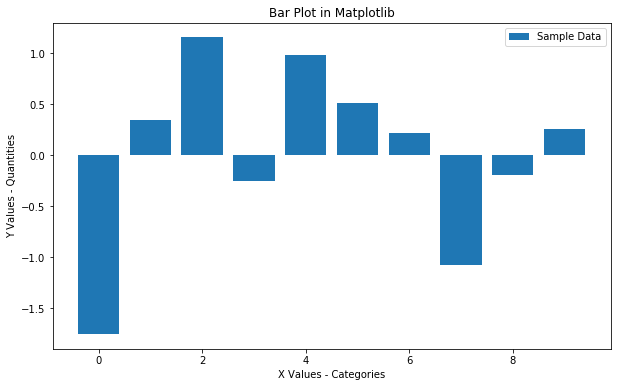
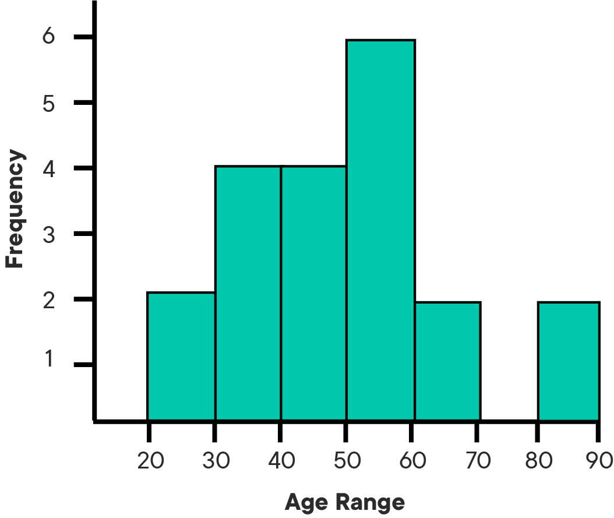

# Data Visualization

## Introduction

This lesson introduces data visualization using Python and the popular Matplotlib plotting library. You will explore the fundamental features of standard Matplotlib plots and how to use them for creating and customizing visualizations. 

## Objectives

You will be able to:

* Use Matplotlib to create a scatter plot
* Use Matplotlib to create a histogram
* Interpret a histogram to gain insight about a distribution of data

## Matplotlib Plotting Library

The Matplotlib plotting library provides a range of built in functions to start visualizing data with minimal effort. 

First, import `matplotlib`'s `pyplot` module (a module is a unit of prewritten code that you can use in your projects) into your working environment along with `numpy` (one of the most popular Python libraries for scientific computing) to create some sample data. You will see that importing the `pyplot` module from Matplotlib provides simple and agile creation of plots. 

```python
import matplotlib.pyplot as plt

```

In Jupyter notebooks, you can use the `%matplotlib` "magic command" with `inline` to show plots inside the notebook or `qt` for external plots. The `inline` option is recommended for most requirements (external plots are suitable for interactive visualizations).  


```python
# Import matplotlib
import matplotlib.pyplot as plt

# Set plot space as inline for inline plots and qt for external plots
%matplotlib inline
```

## Scatter Plots

A scatter plot is a two-dimensional data visualization that uses individual data points to represent the values obtained for two different variables - one plotted along the x-axis and the other plotted along the y-axis. 

Scatter plots are used when you want to show the relationship between two variables. Scatter plots are sometimes called correlation plots because they show how two variables are correlated. 

For this example, you will use Python's `numpy` library to create sample data. The industry standard is to alias `numpy` as `np`. Since `numpy` is a specialized library for scientific computing, it is primarily used for performing numerical operations. Don't worry about all of the details surrounding `numpy` right now, it will be introduced formally later. For now, use [numpy's `linspace()` function](https://docs.scipy.org/doc/numpy-1.14.5/reference/generated/numpy.linspace.html) to quickly generate some dummy data for visualizations.


```python
# Import numpy to generate some dummy data
import numpy as np

# Generate an array x of 30 equally spaced data points on a line space of 0 - 10.
x = np.linspace(0, 10, 30)
# Calcuate sin(x) and save in a new array y
y = np.sin(x)
```

Now that you have your data ready, create a scatter plot using the `plt.scatter()` function which takes in two lists and shows their relationship. You can optionally pass in extra parameters like `label` to provide information about what you are plotting, `plt.title()` for defining a title, and `plt.legend()` to add the label information to the plot in a legend. Finally, use the `plt.show()` function to display the plot.


```python
# Pass in x and y values with a label 
plt.scatter(x, y, label = "Function: sin(x)" )
plt.title('Scatter Plot in Matplotlib')
plt.legend()
plt.show()
```


    

    


In case you are wondering, the above plot shows a sine wave where the y-variable has a periodic dependence on the x-variable. You can customize the plot further to make it easier to read. First, provide some labels for both axes by using `plt.xlabel()` and `plt.ylabel()`. You can also change the size of the plot with `plt.figure(figsize=(a,b))`, where a and b specify the width and height of the plot in inches.


```python
# Set the figure size in inches
plt.figure(figsize=(10,6))

plt.scatter(x, y, label = "y = sin(x)" )

# Set x and y axes labels
plt.xlabel('X Values')
plt.ylabel('Y Values')

plt.title('Scatter Plot in Matplotlib')
plt.legend()
plt.show()
```


    

    


The nice thing is labels and other customizations that you see here are applicable to almost all kinds of plots in Matplotlib. 

### Bar Graphs

Bar graphs (also called "bar charts") are one of the most common plot types for showing comparisons across data. Bar graphs allow comparisons across categories by presenting categorical data as rectangular bars with heights or lengths proportional to the values that they represent. One axis of the graph shows the specific categories being compared and the other axis represents a value scale. The bars can be plotted vertically or horizontally. When the bars are plotted vertically, it is usually referred to as a "column graph." Some examples of bar graphs are shown below.


Matplotlib features a number of handy plotting functions. Matplotlib's `.bar()` and `.barh()` functions can be used to draw constant width vertical and constant height horizontal bar graphs for a simple sequence of x, y values. 

Now that you understand the concepts, try to generate some plots. To do this, first generate some data using functions from the `np.random` module. This is a specialized module for generating random numbers. Don't worry if the code seems unfamiliar now, the details of using `numpy` for generating random numbers will be covered in detail later.


```python
# Set seed for reproducibility
np.random.seed(100)

# Generate the x-axis variable as 10 categories using numpy's arange function
x = np.arange(10)

# For y-axis, generate 10 random quantities
y = np.random.randn(10)
```

Now, plot a bar graph using the above data.


```python
plt.figure(figsize=(10,6))

# Use the bar() function to create a plot using the above values of x and y. Add a label.
plt.bar(x, y, label='Sample Data')

plt.xlabel('X Values - Categories')
plt.ylabel('Y Values - Quantities')

plt.title('Bar Plot in Matplotlib')
plt.legend()

# Output the final plot
plt.show()
```


    

    


That bar graph above is useful because you can easily inspect the quantities in each category (0-10) and make informed decisions about how data are distributed across these categories. 

##  Histograms 

A histogram is a plot that lets you discover the underlying frequency distribution of a data set. It allows you to visualize fundamental properties about the data like if it is skewed in any particular direction or if it has outliers. An example of a histogram of the ages of people is shown below:





Basically, histograms are used to represent data that has been split into some number of groups. The x-axis describes the groups and the y-axis describes the frequency of occurrence. If this is a little confusing, consider the histogram of ages above. The x-axis shows ages in groups of 10 years. The y-axis is a count of how many times a member from each group appears in the data. For example, there are 2 occurrences of ages between 20-30.

It is important to distinguish bar graphs from histograms. Bar graphs show category-specific values and consist of two variables. Histograms show counts of how frequently a given range of values occurs in a data set. Take a look at the examples below and think about how they are different: 

<br>

<br>

You can use the `plt.hist()` function in matplotlib to draw a histogram while passing in values from the required data variable. Say you want to plot a histogram of the retirement ages of 200 people. You can use ```plt.hist()``` to do this:


```python
# Set seed for reproducability
np.random.seed(100)

# Generate a data set of 200 retirement age values
x = 5*np.random.randn(200) + 65

#Plot the histogram with hist() function
plt.hist(x, bins = 10, edgecolor='black')

plt.xlabel('Retirement Age')
plt.ylabel('Frequency of Values')
plt.title('Histograms in Matplotlib')
plt.show()
```


    

    


Recall, the y-axis tells you how often a certain range of numbers appears in the data set. From the histogram, you can see that there are a lot of people who retire around 65. There are significantly fewer people who retire at 75 and even fewer people who retire at 50. 

### The `bins` Argument
Say you want to change the range of values that define the groups of a histogram. You can optionally pass the `bins` argument to set the number of groups. In the plot above, the data have been separated into 10 groups. Check out what happens when you change the number of bins to 5:


```python
plt.hist(x, bins=5, edgecolor='black')
plt.xlabel('Retirement Age')
plt.ylabel('Frequency of Values')
plt.title('Histograms in Matplotlib')
plt.show()
```


    

    


Note the scale of the y-axis and the width of the bars compared to the histogram using 10 bins. The granularity of the bins can be changed according to your specific analytical needs and the amount of data available. For example, if you had 50 data points, you would not want to use 500 bins.  

For the final example, say you got a much larger data set of 10000 retirement ages.


```python
# Set seed for reproducability
np.random.seed(100)

# Generate a data set of 10000 retirement age values
x = 5*np.random.randn(10000) + 65

#Plot the distogram with hist() function
plt.hist(x, bins=50, edgecolor="black")

plt.xlabel('Retirement Age')
plt.ylabel('Frequency of Values')
plt.title('Histograms in Matplotlib')
plt.show()
```


    

    


Notice that the shape of the distribution begins to look more bell-shaped as the size of the data set increases. This is characteristic of an important distribution known as the "Normal" distribution which you will learn more about later.


## Summary

In this lesson, you learned how to use Matplotlib's basic plotting techniques to visually describe your data as scatter plots, bar graphs, and histograms. You also identified use cases for each of these techniques and learned how to customize and add basic details to a plot. 
